<h1 align="center">CPD-Projekt SS2024</h1>

Sven Hoffmann - 2011141

<h4 align="center">
    Diese App vereint nützliche Funktionen, die einem dabei helfen sollen, gute Gewohnheiten aufzubauen.
     
    Primär entwickelt für Android und Webbrowser (Chrome) unter Verwendung von <a href="https://flutter.dev/">Flutter</a>.
</h4>

  <a href="#funktionen">Funktionen</a> •
  <a href="#tools-und-quellen">Tools und Quellen</a>

## Funktionen

### Main Page

#### Home
Diese zentrale Seite der App bietet einen Überblick über alle vorhandenen Funktionen.
- Meditation-Timer
- Pomodoro-Timer
- Exercise-Reminder
- Review

 
Wurde eine Funktion genutzt, wird dem Nutzer dies erkenntlich gemacht, indem ein Haken beim entsprechenden Symbol der Funktion zum Beispiel bei der Streak-Übersicht gesetzt wird.
Für das tägliche Nutzen der genannten Funktionen erhöht sich deren Streak (Lauf), was man der Streak-Übersicht entnehmen kann. Sollte eine Funktion einen Tag lang nicht genutzt worden sein, wird deren Streak bei der nächsten Nutzung der App wieder auf 0 gesetzt.
 

 

  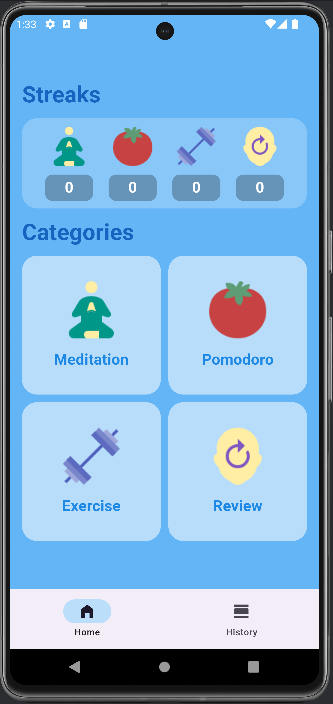
  

 

Webbrowser (Chrome) - Home

 

  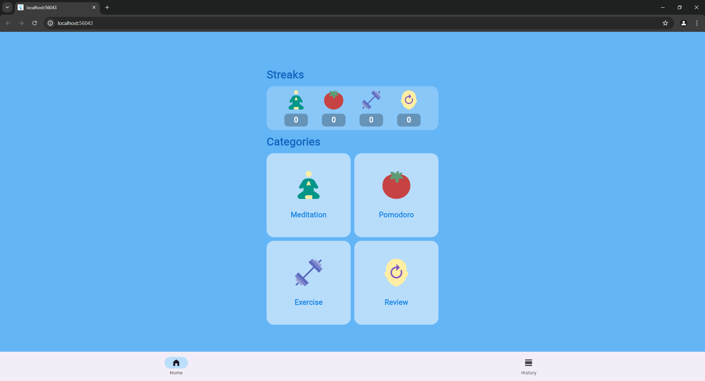

 

#### History

Über die untere Navigationsleiste kann man neben der Homepage auf die History (Verlauf) zugreifen und sich dort eine Übersicht über die letzten sieben Nutzungsaktivitäten der App anschauen. Zu den einzelnen Aktivitäten wird jeweils aufgelistet, von wann die Aktivität ist, welche Funktionen genutzt wurden und das Review an dem Tag, sprich die eingeschätzte Stimmung, mit oder ohne eine zusätzliche Notiz.

 

  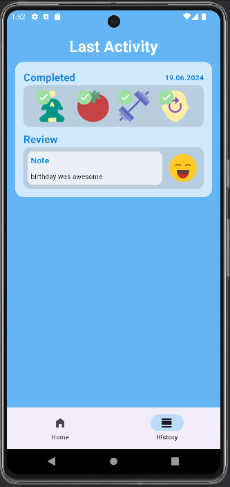
  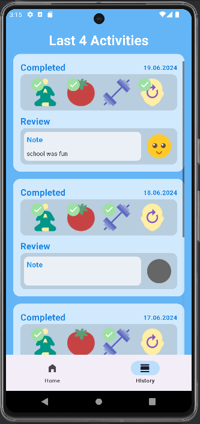

 

Webbrowser (Chrome) - History

 

  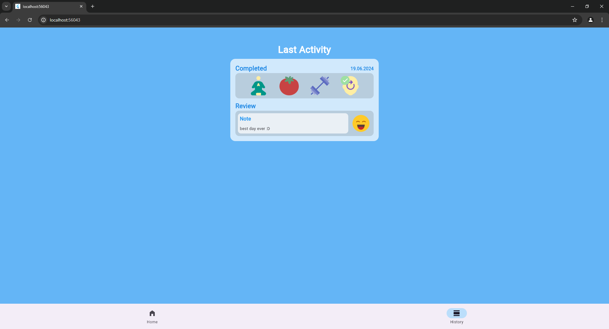

 

### Meditation-Timer
* Manchmal tut es einfach gut, die kreisenden Gedanken zur Ruhe zu bringen. Meditation ist mittlerweile ein gängiges Mittel, um einen Ausgleich im stressigen Alltag zu schaffen. Dieser Meditation-Timer bietet dir jeden Tag die Möglichkeit, für eine kurze Zeit abzuschalten. Nutze daher jeden Tag die Chance, deinen Geist wieder mit deinem Körper in Einklang zu bringen. Der Meditation-Timer endet immer mit einem angenehmen "Gong"-Klang.

 

  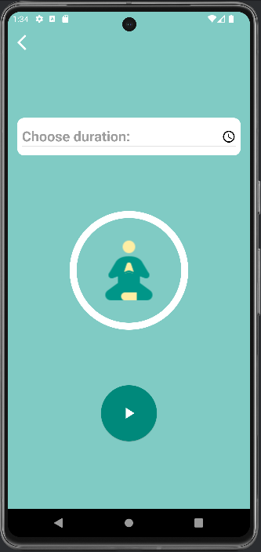
  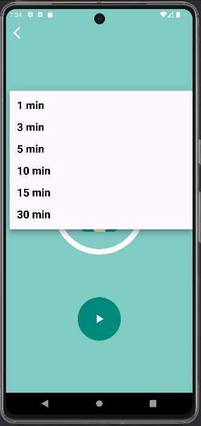
  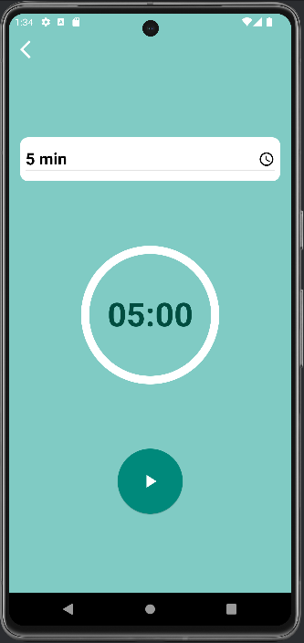

 

GIF - Meditation-Timer

 

      
Ende Meditation-Timer

      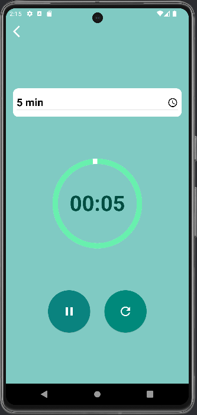
    

 

Webbrowser (Chrome) - Meditation-Timer

 

  
   
   
   
  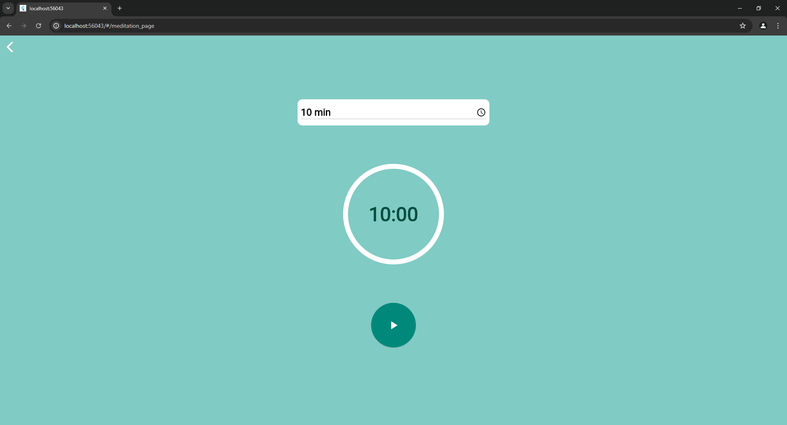

 

### Pomodoro-Timer
* Schonmal von der Pomodoro-Technik gehört? Die Pomodoro-Technik ist beliebt unter Leuten, die gerne fokussiert arbeiten. Man arbeitet dabei in festen Zeitabschnitten, die meist zwischen 25 - 90 Minuten lang sind. Nach diesen Zeitabschnitten folgt immer eine Pause, um dem Kopf ein wenig Zeit zum Durchatmen zu geben. Das ist ein guter Ansatz, um Burnout vorzubeugen. Der Pomodoro-Timer hier hilft dir dabei, dich nur auf deine Arbeit zu konzentrieren. Stelle einfach deine bevorzugte Dauer für einen Arbeitsabschnitt ein. Ist es Zeit für eine Pause, gibt dir der Pomodoro-Timer Bescheid in Form eines Signaltons.

 

  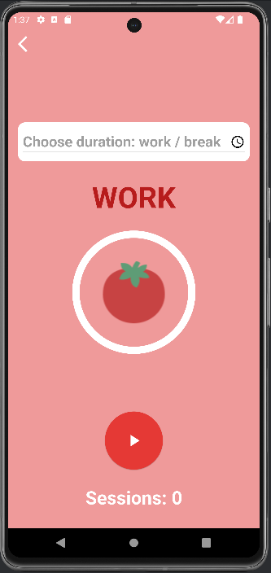
  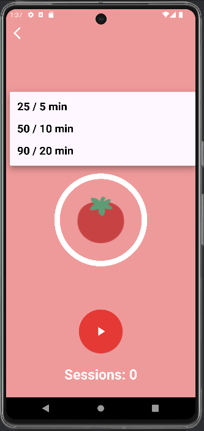
  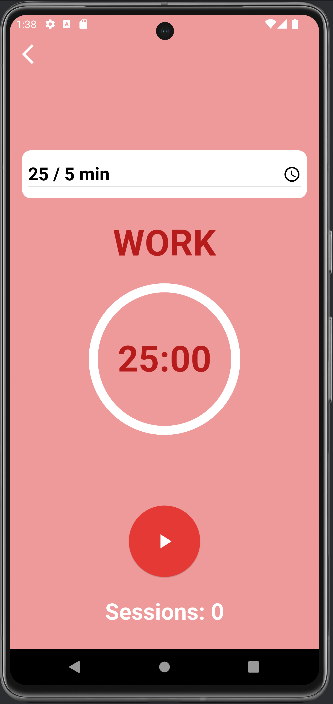

 

GIF - Pomodoro-Timer

 

  

    

      
Ende Arbeitsphase

      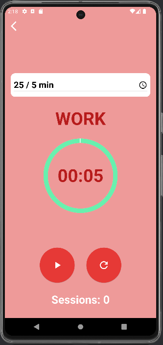
    

    

      
Ende Pause

      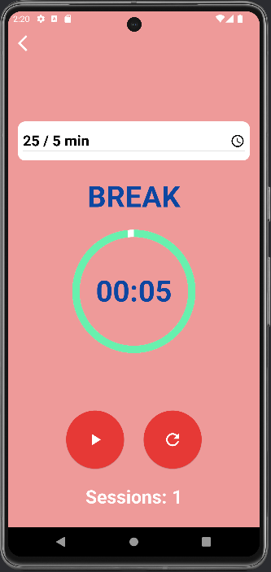
    

  

 

Webbrowser (Chrome) - Pomodoro-Timer

 

  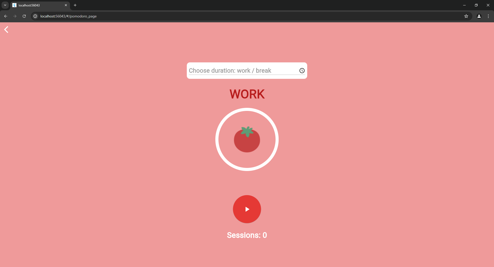
   
   
   
  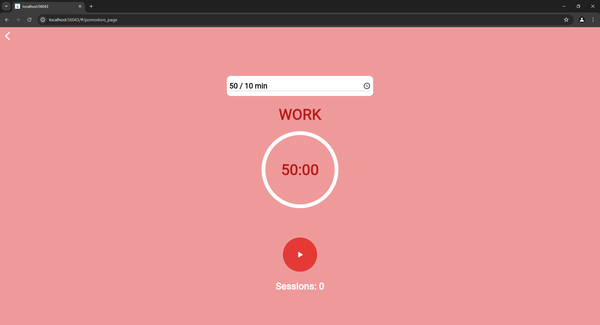

 

### Exercise-Reminder

#### Auflisten von Tätigkeiten
* Lass dich daran erinnern, kleine sportliche Übungen durchzuführen oder einfach nur zwischendurch mal aufzustehen und etwas zu trinken. Damit verhinderst du aufkommende Trägheit und bleibst tagsüber körperlich und geistig fit. Du kannst dafür alle möglichen Tätigkeiten einer Liste hinzufügen.

 

  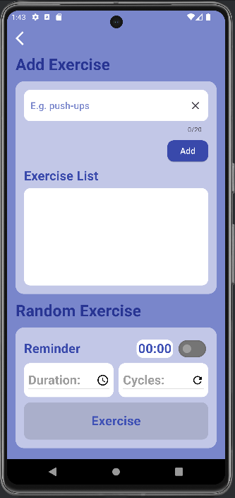
  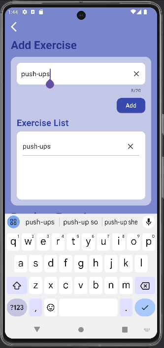

 

#### Aktiver durch Erinnerung
* Der Random Exercise Timer erinnert dich dabei an eine zufällige Tätigkeit aus deiner zuvor erstellten Liste. Sei also bereit spontan mal ein paar Liegestütze machen. Du entscheidest selbst wann und wie oft du erinnert werden möchtest. Nach Ablauf des Timers ertönt ein Signalton.

 

  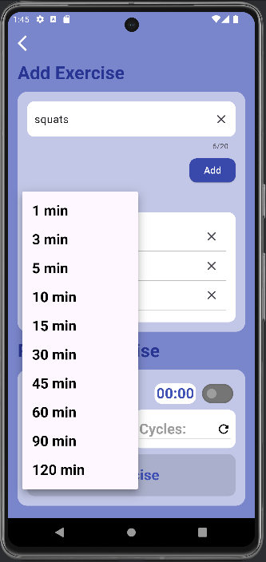
  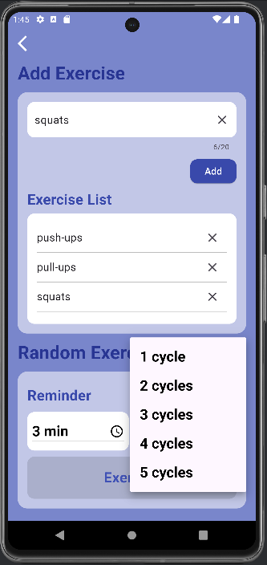
  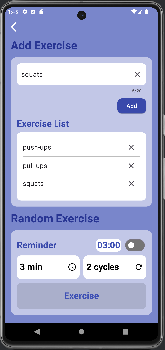

 
 
 

    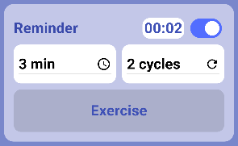

 

Webbrowser (Chrome) - Exercise

 

  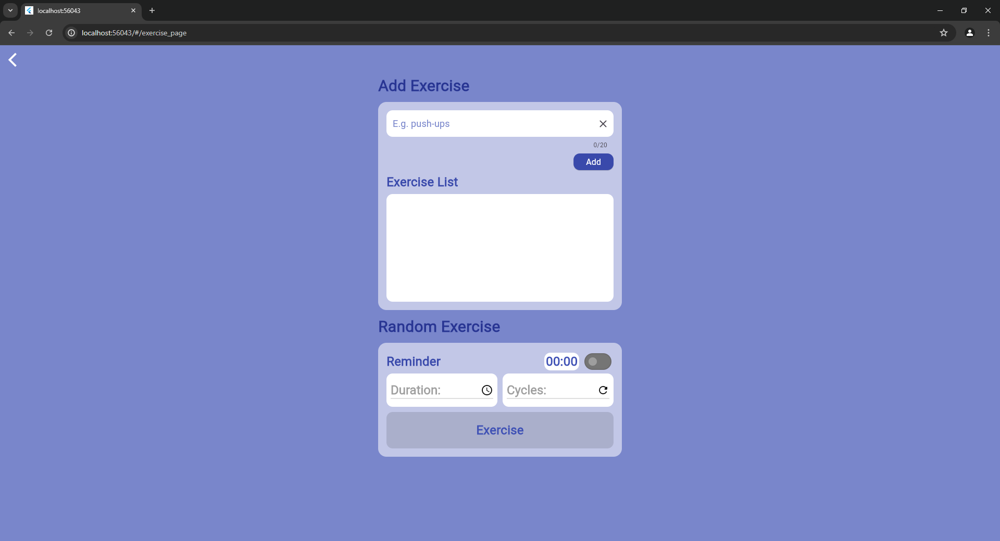
   
   
   
  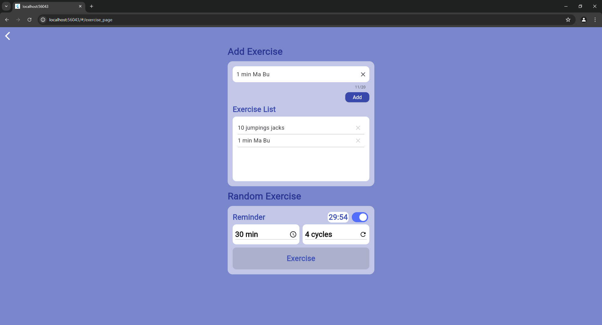

 

### Review
* Wie war eigentlich dein Tag? Viel zu selten hält man inne und reflektiert, wie es einem denn so geht. Oder die Tage gehen vorüber und man kann sich nicht mehr daran erinnern, was man diese Woche alles unternommen hat. Die Review-Funktion soll einem eine Möglichkeit bieten, kurz festzuhalten, wie man sich nach einem Tag fühlt. Man kann über eine Emoji-Skala einordnen, wie die Stimmung von einem ist und hat die Möglichkeit, eine kurze Notiz zu verfassen, um zum Beispiel ein besonderes Event des Tages hervorzuheben. Das Ganze dient als eine Art kleiner Tagebucheintrag, der als Gedächtnisstütze fungieren kann, aber auch um sich vor Augen zu führen, was einen womöglich momentan (emotional) beschäftigt.

 

  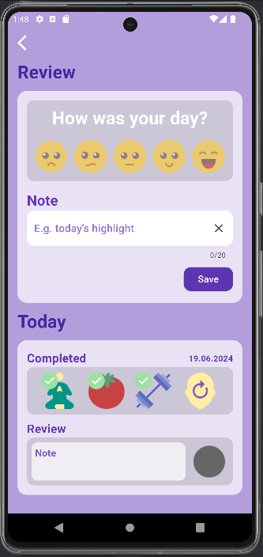
  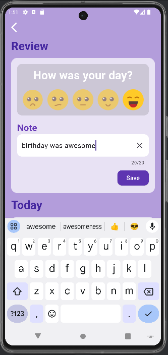
  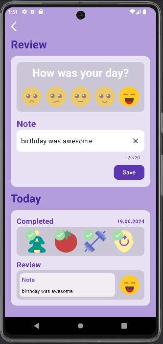

 

Webbrowser (Chrome) - Review

 

  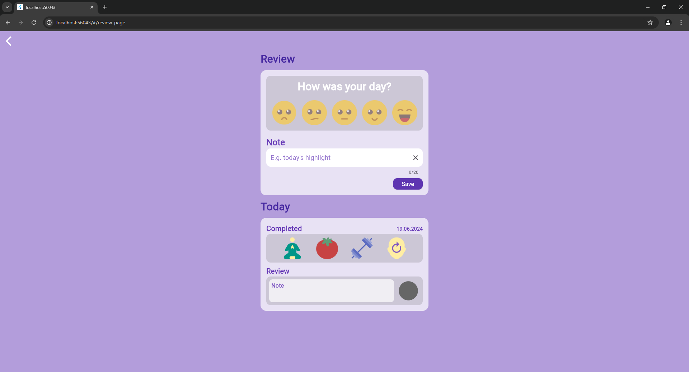
   
   
   
  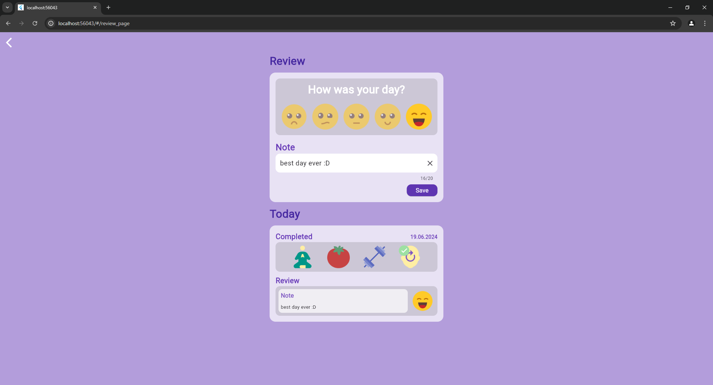

 

## Tools und Quellen

* Flutter mit [Android Studio](https://developer.android.com/studio?hl=de)
* NoSQL Datenbank [Hive](https://pub.dev/packages/hive)
* Icons von [Icons8](https://icons8.de/)
* Sounds von [Pixabay](https://pixabay.com/de/sound-effects/) (Pixabay, floraphonic)